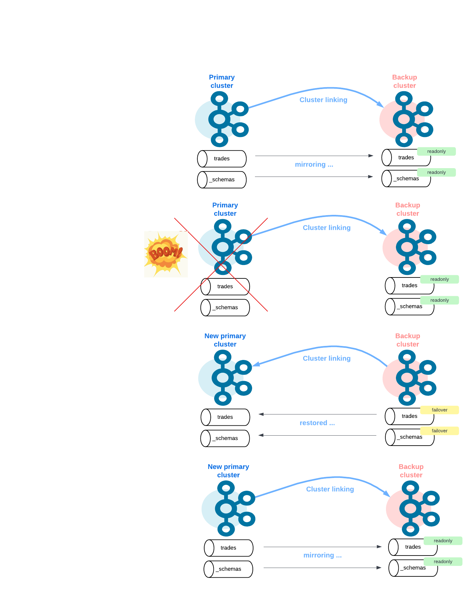

# How to create a backup cluster with Cluster Linking

## Use case

Create a Disaster Recovery (“DR”) cluster to backup and save data from the primary cluster. Cluster Linking keeps your DR cluster in sync with data, metadata, topic structure, topic configurations, and consumer offsets so that you can achieve low recovery point objectives (“RPOs”) and recovery time objectives (“RTOs”), often measured in minutes.

## Setup

A primary cluster which used by producers and consumers enforced with a schema registry. A disaster recovery cluster without schema registry to copy byte-to-byte from source topics. It's like a kafka snapshot real time for recovering data if the primary cluster crashed with less potential data lost.

**Disclaimer** : RPO > 0 & RTO > 0


## How to run ?

This simulation spin up a primary cluster (1 Broker, 1 Zookeper, 1 Schema Registry) and a dr cluster. A topic `trades` is created in the primary cluster which enforce by a schema AVRO.



``` bash
./run.sh
```

## How to stop ?

``` bash
./stop.sh
```